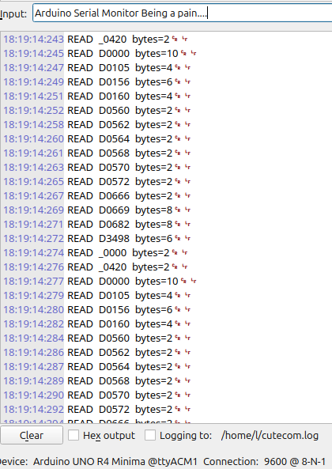

# HMI Register Discovery Tools
<pre>
HMI_decode/
├── ard_hmi.pdf              <-- initial docs
├── ard_hmi.tex              <-- initial docs src
├── arduino_hmi_listener.png <-- output
├── hmi_listener
│   └── hmi_listener.ino     <-- logs register requests from arduino minima + W5500 shield
├── hmi_register_logger2.py  <-- logs register requests from a PC
├── hmi_registers.txt        <-- Example PC output
├── MiSmTCP.py               <-- supporting library

</pre>

The Gist:
Read the requests, and return 0. this will keep the HMI active


## Purpose

These programs were created to determine what is required to initialize active communications with an IDEC HMI.

The documentation suggests that communication can be initialized by populating a specific set of registers.

In practice, the behavior is somewhat different:

> The HMI will initialize and remain active as long as at least one requested register on each page receives a valid response.

This changes the problem from:

> Which documented registers must be populated?

to:

> Which registers is the HMI actually polling?

## Why This Matters

In this case, I wrote the HMI project, so I already know which registers it is configured to use.

However, that may not always be true.

The HMI could be part of a large team project, an inherited system, or a project without complete documentation. It would be possible to review the HMI program and manually create a list of every register, but that would be slow, tedious, and error-prone.

Instead, these programs observe the Maintenance Protocol requests and report which registers the HMI is attempting to read or write.

## Early Investigation and False Leads

After reading the documentation and failing to get the expected results, I began to suspect that the documentation might be incorrect. At the very least, its description of the initialization requirements was vague.

One early theory was that the HMI might only communicate with devices that appeared to be manufactured by IDEC.

To test this, I changed the Arduino Ethernet MAC address to use IDEC's registered MAC address prefix:

```cpp
byte mac[] = {
    0x00, 0x03, 0x7B, 0x20, 0xFE, 0xED
};
```

This did not meaningfully change the HMI's behavior.

## Observing the Protocol Directly

I then analyzed the network traffic and searched for the register addresses defined in the HMI project. I was unable to identify them clearly in the captured packets.

The next step was to create an Arduino-based Maintenance Protocol listener.

Instead of trying to infer the HMI's behavior from a packet capture, the Arduino responded as a Maintenance Protocol device and displayed the requests directly.

This immediately provided much better information about:

* Which registers were being requested
* Which request types were being used
* When the HMI considered communication active
* Which responses were sufficient to keep each HMI page active

After confirming the approach with the Arduino, I created a second implementation that performs the same task on a PC.




## Previous Workflow

Earlier testing required several separate steps:

1. Capture the HMI network traffic.
2. Analyze the packets manually.
3. Identify the relevant request data.
4. Reproduce the observed responses with an Arduino.
5. Repeat the process whenever the HMI project changed.

These programs significantly simplify that workflow.

Rather than manually extracting register requests from packet captures, the listener reports the registers being requested directly. This makes it much easier to determine the minimum register support required for an HMI project to initialize and remain connected.
